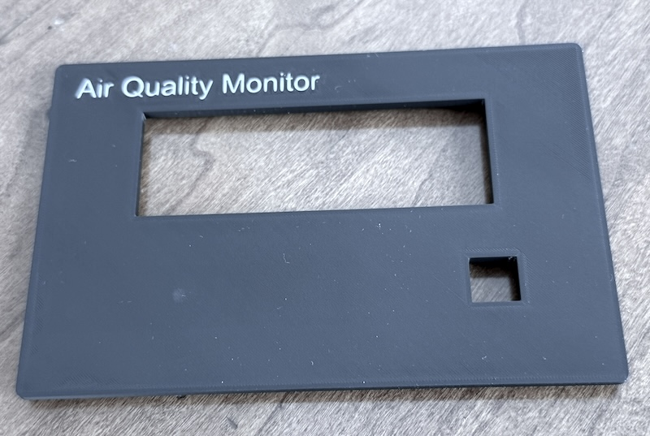
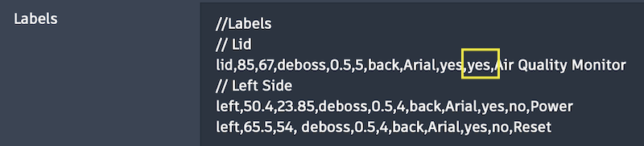
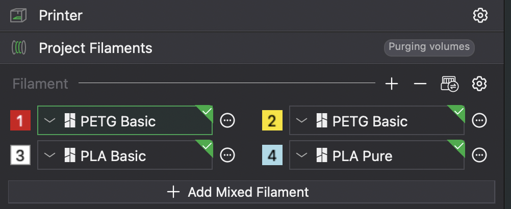
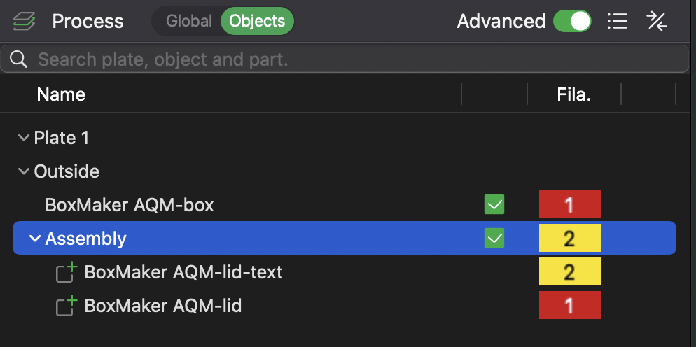
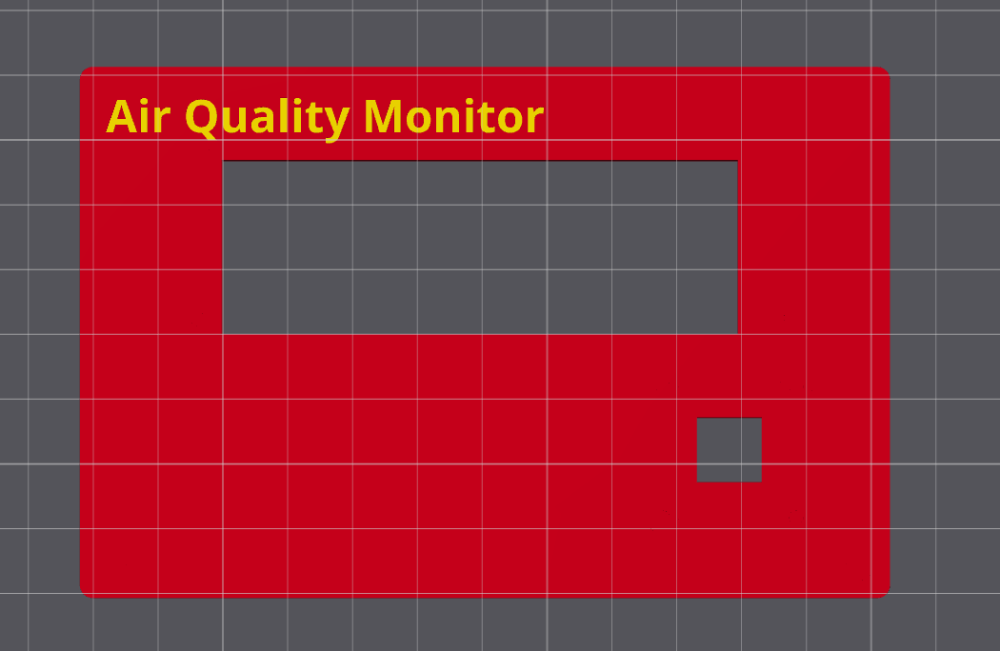
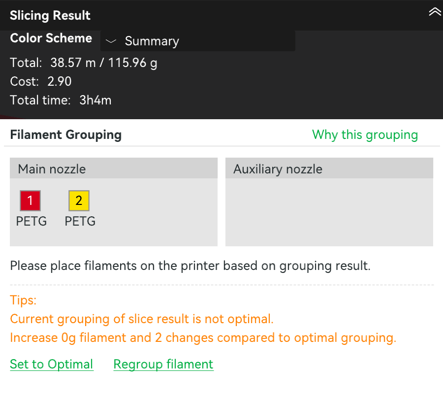
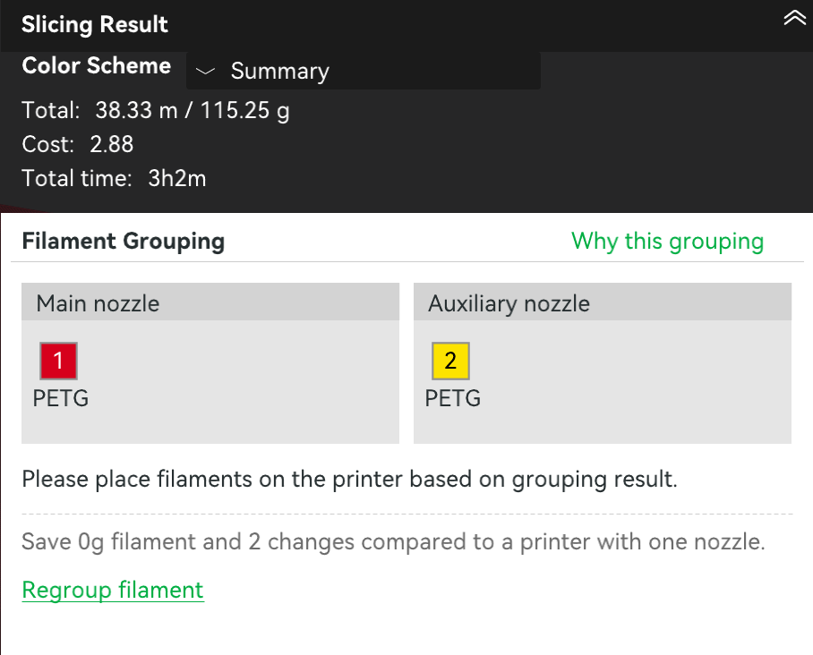

# Multi-color text labels -- BoxMaker -> Bambu Studio -> Bambu X2D

This application note covers the workflow for printing text labels in a different filament color from the rest of the box, using BoxMaker's `SeparateBody` option and a Bambu Lab printer with multi-material capability (AMS, dual nozzle, or both).



> **Tested configuration**
> - **Printer:** Bambu Lab X2D (firmware 1.01.00.00) with AMS Pro
> - **Slicer:** Bambu Studio Beta 2.6.1.55
>
> This guide is written for the X2D Printer. The general workflow should translate to other dual-nozzle Bambu printers (e.g. H2D) and to single-nozzle AMS printers (where the AMS handles all filament swaps on one nozzle). Other slicers and non-Bambu printers are not covered here -- the BoxMaker side (the `SeparateBody` option) applies to any multi-material slicer, but the slicer-side steps will differ.

> **Pick your path before you start.** Two ways to print multi-color on the X2D:
>
> 1. **AMS-only on Main nozzle.** Both the body and the text filament live in AMS slots. Filament swaps happen on the Main nozzle with a small purge per swap. Simpler workflow, slightly more filament waste. Recommended for one-off prints and casual use.
> 2. **External holder + Aux nozzle.** Body filament in the AMS; text filament in the External filament holder feeding the Auxiliary nozzle. No purge waste at color changes -- they're nozzle switches, not filament swaps. Requires loading the External holder (~8 min) and a slightly more difficult Bambu Studio setup. Worth it for repeat prints with the same color combo, or for material pairs that don't purge cleanly through one nozzle (TPU, soluble supports).
>
> The BoxMaker side and most of the Bambu Studio workflow is identical for both paths. They diverge only at the **Slicing** step, which is clearly forked below.

## Contents

- [Tested configuration](#tested-configuration) (see above)
- [When to use SeparateBody](#when-to-use-separatebody)
- [Setting up the text label in BoxMaker](#setting-up-the-text-label-in-boxmaker)
- [What the bodies look like in the viewport](#what-the-bodies-look-like-in-the-viewport)
- [Exporting from BoxMaker as 3MF](#exporting-from-boxmaker-as-3mf)
- [Setting up the X2D and Bambu Studio](#setting-up-the-x2d-and-bambu-studio)
- [Importing the 3MF into Bambu Studio](#importing-the-3mf-into-bambu-studio)
- [Assigning filaments and merging](#assigning-filaments-and-merging)
- [Slicing the part](#slicing-the-part)
  - [Path A: AMS-only on Main nozzle](#path-a-ams-only-on-main-nozzle)
  - [Path B: External holder + Aux nozzle](#path-b-external-holder--aux-nozzle)
- [Troubleshooting](#troubleshooting)

## When to use SeparateBody

Standard `emboss` and `deboss` text labels print in a single color -- even on a multi-material printer. They look fine for tactile or visual labeling but the contrast is only what the surface relief provides.

`SeparateBody=yes` (in the Text Labels textarea in the BoxMaker sidebar) emits the text as a separate body, distinct from the lid or wall it sits on. In a multi-material slicer, you assign a different filament to that text body and the printer prints the text region in a different color.

Use this when you want:

- **Crisp colored text** on a box (e.g. white `Air Quality Monitor` lettering on a matte-black lid)
- **Iconography or branding** in a brand color
- **High-visibility labels** like `WARNING` or `100V` that need to stand out

### A note on nozzle size for small text

A 0.4 mm nozzle (the default on most printers) prints text down to about 8 mm character height with acceptable quality. For anything smaller, or for fine-detail fonts with thin strokes, swap to a **0.2 mm nozzle** before printing -- letter strokes and counters come out crisp instead of muddy.

## Setting up the text label in BoxMaker

In the sidebar, scroll to the **Text Labels** section and add a line with `SeparateBody=yes` (the 10th comma-separated field):

```
// Format: Surface,X,Y,Type,Depth,Height,Direction,Font,Bold,SeparateBody,Text
lid,30,40,deboss,1,6,back,Open Sans,yes,yes,Air Quality Monitor
```

Field-by-field:

| Field | Value | Notes |
|---|---|---|
| Surface | `lid` | Where the label goes |
| X, Y | `30, 40` | Center of the label, mm from the surface's 0,0 origin |
| Type | `deboss` | `deboss` = body extrudes INTO the lid (flush surface, color difference visible). `emboss` = body sits ON the lid (raised, plus a small anchor into the wall) |
| Depth | `1` | mm -- how far the body extends into (or out of) the surface |
| Height | `6` | mm -- character height |
| Direction | `back` | Which adjacent surface the top of the text points toward |
| Font | `Open Sans` | One of the bundled fonts (Atkinson Hyperlegible, JetBrains Mono, Open Sans), or any custom font you've uploaded |
| Bold | `yes` | |
| SeparateBody | `yes` | **The key field** -- opt in to separate-body / multi-color behavior |
| Text | `Air Quality Monitor` | The actual text |



The 3D preview updates immediately. No "run" or "OK" button -- just type the line and watch.

## What the bodies look like in the viewport

When `SeparateBody=yes`, BoxMaker renders the text in a bright yellow accent color (`#ffea4b`) in the viewport, distinct from the box and lid colors. This is purely a visual cue so you can see at a glance which labels will be a different color in the printed result. The slicer ignores this color; you'll assign the actual print color in Bambu Studio.

For deboss labels, the yellow text sits flush with the surface (recessed into the box or lid). For emboss labels, it stands proud of the surface.

All separate-body text labels on a given surface group are unioned together internally into a single mesh per surface:

- **Box surfaces** (front / back / left / right / floor): all separate-body labels become one mesh, exported as `<designname>-box-text`.
- **Lid surface**: all separate-body labels become one mesh, exported as `<designname>-lid-text`.

This means you'll have at most two text objects to deal with in the slicer, regardless of how many labels you've added.

## Exporting from BoxMaker as 3MF

Click **Export 3MF** in the sidebar toolbar. BoxMaker downloads a single `.3mf` file containing each part as its own object:

- `<designname>-box` -- the main box body
- `<designname>-lid` -- the lid (oriented for printing: flipped 180 deg around X so deboss recesses sit on the build plate, and offset in X so it sits beside the box instead of inside it)
- `<designname>-box-text` -- all separate-body labels on box surfaces (only present if any exist)
- `<designname>-lid-text` -- all separate-body labels on the lid (only present if any exist)

The 3MF declares units explicitly as millimeters and embeds no color metadata, so Bambu Studio's importer should have minimal surprises (see the next section).

## Setting up the X2D and Bambu Studio

Do this once, before you import your part:

1. On the printer, install the build plate you plan to use (e.g. textured PEI).
2. Load the filaments you plan to use. For each one, edit its type on the printer screen so the type and color are reported correctly.
   - **Path A (AMS-only):** load both the body filament and the text filament in AMS slots. Leave the External holder empty.
   - **Path B (External holder + Aux nozzle):** load the body filament in the AMS, and the text filament in the External filament holder.
3. Launch Bambu Studio. On the **Prepare** tab, in the top-left panel:
   - Select your printer (Bambu Lab X2D).
   - Select your plate type to match the printer.
   - Click **Sync info**. When the small "Continue to sync filaments" prompt appears, click it. This pulls the printer's nozzle config and current AMS/External filaments into the project.
4. Check the **Project Filaments** section in the left panel. The filaments installed on your printer should now be listed. If anything is missing or wrong:
   - Click the small **printer icon** (to the left of the gear icon) at the top-right of the filament list to re-read the filaments from the printer.
   - Delete any extra filaments by clicking the **`...`** (three dots) menu next to the slot and choosing Delete.
   - You can also click the dropdown arrow next to each slot number to manually pick a color from the printer list.
5. Leave Bambu Studio open. You'll load the part in the next section.



## Importing the 3MF into Bambu Studio

Drag the BoxMaker-exported 3MF file onto the build plate, or use **File -> Import -> Import 3MF/STL/STEP/...**.

You'll see one prompt (and possibly two defensive ones).

### Prompt 1: "The 3mf is not from Bambu Lab, load geometry data and color data only."

Click **OK**. This is normal -- the 3MF wasn't authored by Bambu Studio.

### "This file contains several objects..." -- if it appears

Click **No**. You want the lid and box to be considered as multiple objects. 

## Assigning filaments and merging

Your part is now on the plate. In the **Objects** panel (Prepare tab -> Process section -> Objects), you'll see your parts listed -- typically:

- The main body (e.g. `MyDesign-box` or `MyDesign-lid`, depending on which part has the labels)
- The corresponding text mesh (e.g. `MyDesign-lid-text`)

### 1. Assign filaments

1. Click the **body object** (e.g. `MyDesign-lid`) in the Objects panel. Click its filament-color box and assign your body filament (e.g. slot **2**, AMS, black).
2. Click the **body object** (e.g. `MyDesign-box`) in the Objects panel. Click its filament-color box and assign your body filament (e.g. slot **2**, AMS, black).
3. Click the **text object** (e.g. `MyDesign-lid-text`). Click its filament-color box and assign your text filament (e.g. slot **5**, External holder, white).

In our example: box and lid uses filament **1** (Red, from AMS), text uses filament **2** (yellow, from AMS).

### 2. Merge the body and the text into one assembly

1. Click the body object that contains the text (e.g. `MyDesign-lid`) in the Objects list.
2. Cmd-click (or Ctrl-click) the corresponding text object (e.g. `MyDesign-lid-text`) to add it to the selection. 
3. Right-click on any selected object -> **Merge**.

After the merge, the assembly behaves as a single part for positioning and slicing, but each sub-part keeps its own filament index -- which is exactly what makes the body print in one color and the text in another.



If you have separate-body labels on the box body AS WELL AS on the lid, repeat the merge for the box pair: select `MyDesign-box` and `MyDesign-box-text` and merge them too.

After the Merge, arrange the pieces on the build plate as you like (or right-click and choose Arrange).

After an arrange, a tall 2-color prime tower also appears; it shrinks once filament grouping is set (below).

## Slicing the part

Switch to the **Preview** tab and slice.

If the text is facing down and you can't see it from the default view, **left-click and drag** anywhere in the viewport to rotate the plate and flip the lid over.



This is where the two paths diverge. Bambu Studio's automatic filament grouping may not reliably do the right thing, so you'll always confirm the grouping manually before the final slice. Follow the path that matches your setup.

### Path A: AMS-only on Main nozzle

Both filaments are in the AMS; you're not using the External holder. Bambu Studio's auto-grouper will routinely assign one of the AMS filaments to the Auxiliary nozzle anyway -- because the X2D *has* an Aux nozzle, Studio assumes you want to use it. If nothing is loaded on the Aux side, the print will fail or silently come out single-color.

Force both filaments onto Main:

1. Click the green dropdown arrow next to **Slice plate** (top right) -> **Regroup filament** -> **Custom**.
2. Drag **both filaments to the Main Extruder column**, leaving the Auxiliary Extruder column empty.
3. Click **OK** and re-slice.

You'll see a wipe tower next to your part -- that's where the printer purges between AMS color swaps.



### Path B: External holder + Aux nozzle

Body filament is in the AMS; text filament is in the External holder. Bambu Studio's default grouping mode (Filament-Saving) may still consolidate both filaments onto the Main nozzle to "save" a tool change -- leaving the Aux nozzle empty and silently printing your text in the body color. If this happens you will need to do the next step.

Force the dual-nozzle mapping:

1. Click the green dropdown arrow next to **Slice plate** (top right) -> **Regroup filament** -> **Custom**.
2. Drag filaments between **Main Extruder** and **Auxiliary Extruder** columns so the **text filament sits on Auxiliary** and the **body filament sits on Main**.
3. Click **OK** and re-slice.



### How to tell the slice actually went multi-color (both paths)

The simplest check is visual: in the Preview, the text should appear in a clearly different color from the body. That's what you're looking for.

Two additional signals confirm it:

- A **wipe tower** appears next to your part on the plate.
- The Slicing Result panel shows the right filaments on the right nozzles in the Filament Grouping section -- both on Main for Path A, one on each for Path B.

If the text shows in the body color, the wipe tower is missing, or the nozzle assignments are wrong, see [Troubleshooting](#text-only-prints-in-one-color-or-nozzles-empty) below.

### Save the project

Once the slice looks right, press **Cmd+S** (or Ctrl+S) and save the project as a `.3mf`. Filament-grouping settings are stored at the plate level inside the file, so saving immediately preserves your Custom mapping. Reopening the saved `.3mf` keeps everything ready to print -- without this, certain plate edits can flip the grouping back to Auto and you'll be redoing the Custom regroup.

## Troubleshooting

### Text only prints in one color, or nozzles empty

If the slice preview shows the text in the body color, no wipe tower appears, or the Slicing Result's Filament Grouping panel is wrong for your path, work through these in order:

**1. Confirm Custom filament grouping for your path.** Slice plate dropdown -> Regroup filament -> Custom, then:

- **Path A (AMS-only):** both filaments belong on the **Main Extruder** column. The Auxiliary column should be empty.
- **Path B (External holder + Aux):** the text filament belongs on **Auxiliary Extruder**, the body filament on **Main Extruder**.

Click OK and re-slice.

**2. Save the project.** Cmd+S the `.3mf` after the Custom regroup succeeds. The Custom mapping is stored at the plate level inside the file, and saving locks it in so re-opening doesn't revert to Auto.


### "Conflicts of gcode paths have been found at layer 1."

A warning toast pops up from the slicer with this message when the body and text are still separate top-level objects. Select the body and its text mesh together -> right-click -> **Merge**. They become one multi-part assembly and the warning clears.

### Letters look muddy or have missing strokes in the slice preview

Your text height is too small for the current nozzle. Try, in order of effort:

- Set `Bold=yes` in the Text Labels input -- thicker strokes survive a 0.4 mm nozzle much better.
- Increase `Height` in the Text Labels input (8 mm or larger usually works at 0.4 mm nozzle).
- Swap to a **0.2 mm nozzle** before printing -- best for fine-stroke fonts or text smaller than ~8 mm.

### Text body sticks out of the lid in the preview

You're using `emboss` instead of `deboss` with `SeparateBody=yes`. With emboss, the body sits **on top of** the lid and protrudes by Depth mm. That's a valid mode (raised lettering in a different color) but if you wanted flush text, change Type to `deboss` in the Text Labels input.


